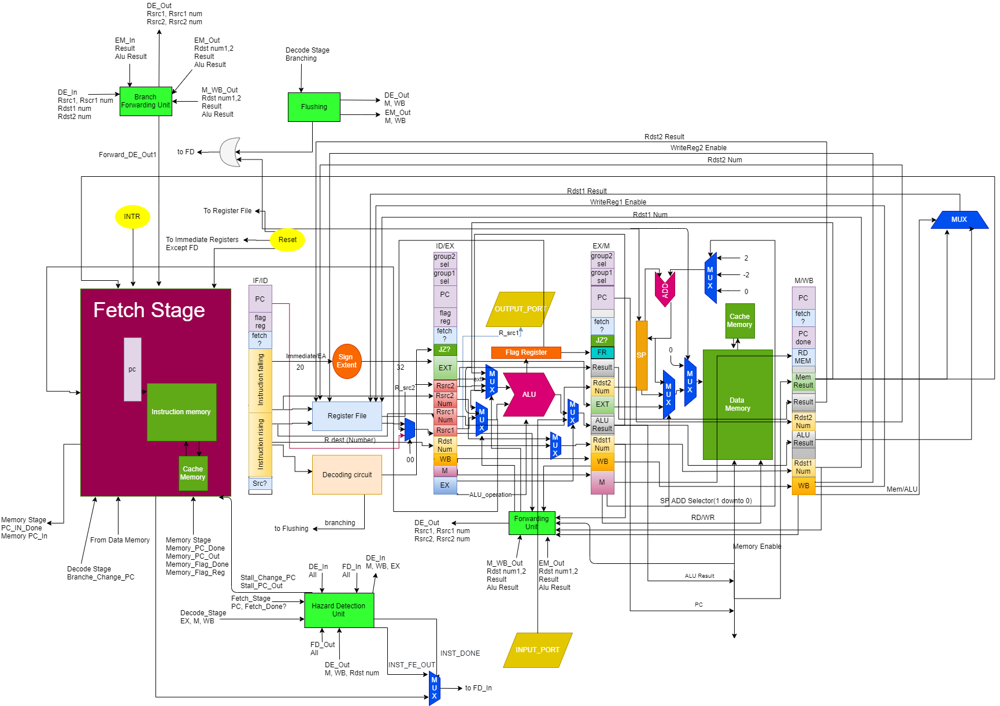

# Pipelined Processor Architecture

## Assembler
To run the assembler you need to have have python installed on your machine and can run it with the following command:
```bash
python Assembler.py <FILE_NAME>.asm
```
It will create <b>two</b> output files (.hex & .bin) with the same name of the input file (e.g. Test.asm -> Test.hex & Test.bin).

Both <b>Hex</b> and <b>Bin</b> files have the same content but one in <i><b>Hexdecimal</b></i> coding style and the other is in  <i><b>Binary</b></i> coding style.

## Design


## Team members
[Ayman Azzam](https://github.com/AymanAzzam)

[Amr Aboshama](https://github.com/Amr-Aboshama)

[Menna Fekry](https://github.com/MennaFekry)

[Reham Ali](https://github.com/rehamaali)